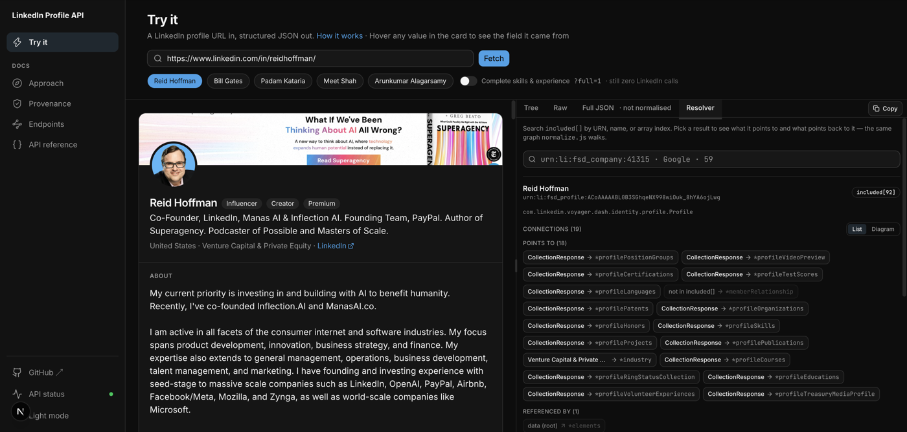
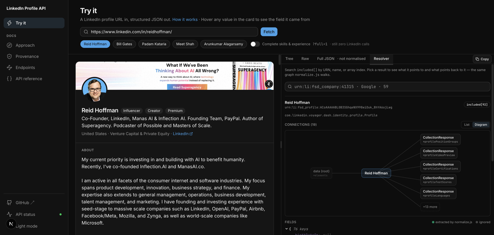
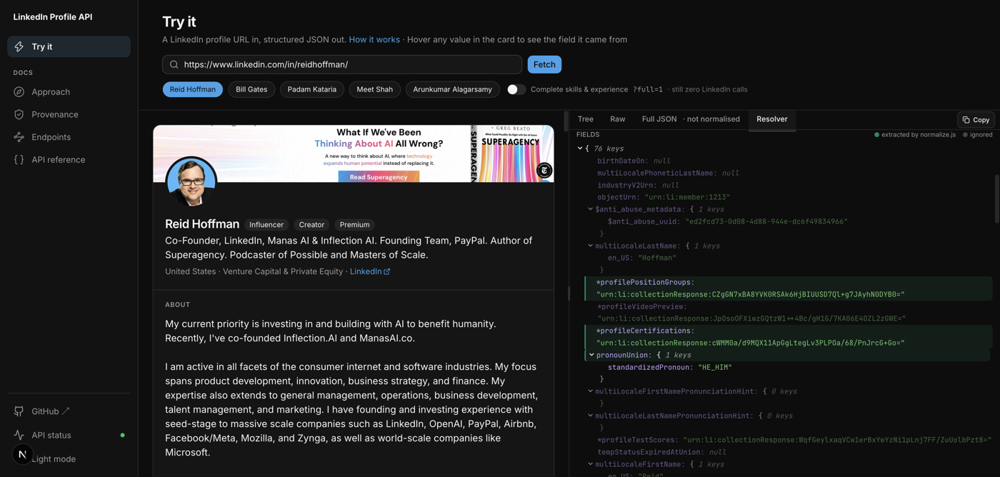

# LinkedIn Profile API

A hosted HTTP API that accepts a LinkedIn profile URL and returns the profile's
information (name, headline, location, about, experience, education, skills,
certifications, languages, profile images, featured links, volunteer
experience, honors & awards, publications, career breaks) as structured JSON.

The data is retrieved by calling LinkedIn's own internal **Voyager** API directly
with server-side session cookies. **No browser automation** (Selenium / Puppeteer
/ Playwright) and **no HTML scraping** — authenticated `GET` requests against
LinkedIn's own JSON APIs, then a pure-function transform of the response. One
request covers the whole profile; a second covers career breaks, which no
Rest.li resource carries (see [Known limitations](#known-limitations)).

- **Showcase site:** https://linkedin-profile-api-phi.vercel.app — the live app on
  the home page, with these docs in the sidebar.
- **Live API:** https://linkedin-profile-api-production-3c84.up.railway.app
- **Try it now:**
  [the app](https://linkedin-profile-api-phi.vercel.app/) ·
  [`/profile/sample`](https://linkedin-profile-api-production-3c84.up.railway.app/profile/sample)
  (a real cached response, no credentials needed) ·
  [`/profile?url=…williamhgates`](https://linkedin-profile-api-production-3c84.up.railway.app/profile?url=https://www.linkedin.com/in/williamhgates/)
  (live)

---

## Table of contents

- [Quick start](#quick-start)
- [API documentation](#api-documentation)
- [Response schema](#response-schema)
- [Approach — how the endpoint was reverse-engineered](#approach--how-the-endpoint-was-reverse-engineered)
- [The endpoint](#the-endpoint)
- [Architecture](#architecture)
- [Deployment](#deployment)
- [Known limitations](#known-limitations)
- [Secrets](#secrets)

---

## Quick start

Requires Node.js ≥ 20.

```bash
git clone https://github.com/arun-dev-des/linkedin-profile-api.git
cd linkedin-profile-api
npm install

cp .env.example .env
# edit .env — see "Getting the credentials" below

npm run dev          # http://localhost:3000
npm test             # 57 tests, fully offline
```

### Getting the credentials

The server authenticates to LinkedIn with two cookies from a logged-in browser
session on **your own** LinkedIn account:

1. Log in to linkedin.com in a browser.
2. DevTools → **Application** → **Cookies** → `https://www.linkedin.com`.
3. Copy the **`li_at`** value into `.env`.
4. Copy the **`JSESSIONID`** value into `.env` — **without** the surrounding
   quotes (it looks like `ajax:1234567890123456789`).

Both must come from the same session. They expire (see
[Known limitations](#known-limitations)); re-extract when `/profile` starts
returning `502 upstream_auth_failed`.

---

## API documentation

Base URL: the deployed origin, or `http://localhost:3000` in development.

### `GET /profile`

Fetch and normalize a LinkedIn profile.

| Query param | Required | Description |
| --- | --- | --- |
| `url` | yes | A LinkedIn profile URL. Accepts `https://www.linkedin.com/in/<id>/`, locale subdomains (`in.linkedin.com`), trailing paths, and query strings. |
| `full` | no | `full=1` also fetches the **complete skills and experience lists**. The main call caps skills at 20 and experience at 10 position groups; with `full=1` the service spends one extra upstream request *per capped section* (only when that section's cap was actually hit, run in parallel) and the matching `meta.partial` key disappears. Off by default — see [Known limitations](#known-limitations) and [`docs/endpoint-map.md`](docs/endpoint-map.md). |

```bash
curl 'http://localhost:3000/profile?url=https://www.linkedin.com/in/williamhgates/'
curl 'http://localhost:3000/profile?url=https://www.linkedin.com/in/williamhgates/&full=1'
```

Successful responses are cached in-memory for ~1 hour (`meta.cached` tells you
which you got). `full=1` and the default are cached separately.

### `GET /profile/raw`

Same `url` parameter. Returns the **unprocessed Voyager payload** — `data` plus
the flat `included[]` array of URN-cross-referenced entities — before
normalization. This is what `src/linkedin/normalize.js` consumes; the "Full JSON ·
not normalised" tab in the browser UI renders it. Also `GET /profile/sample/raw`
for the payload behind `/profile/sample`.

`?full=1` (same flag as `/profile`) merges in the same skills/experience
completion calls, so this view isn't stuck showing the main call's capped
lists while `/profile?full=1` shows the complete ones. Skills are merged
faithfully — the capped `*profileSkills` collection is repointed at every
skill. Experience only gets newly-seen `Position` entities added to
`included[]` (searchable in the browser UI's Resolver tab) — the completion
finder returns a flat list with bare `companyUrn`/`employmentTypeUrn`, not the
nested `PositionGroup` shape the main call's decoration returns, so
reconstructing that nesting here would mean inventing group data LinkedIn
never actually sent for this call. See `mergeSkillsCompletion()` /
`mergePositionsCompletion()` in
[`src/linkedin/normalize.js`](src/linkedin/normalize.js).

LinkedIn's own response embeds a little of the *credentialed account's*
identity in this payload (its connection-degree relationship to people
referenced on the profile) — irrelevant to the person being looked up, and
not something a public, unauthenticated endpoint should hand out. Both raw
endpoints strip it via `sanitizeRawPayload()` before responding; see
[`src/linkedin/normalize.js`](src/linkedin/normalize.js).

**Exploring the raw payload:** the browser UI's **Resolver** tab searches this
`included[]` graph by URN, name, or array index, then lets you follow it —
what an entity points to, what points back to it — with a real breadcrumb and
Back (a history stack, not a "referenced by" shortcut that breaks once an
entity has more than one referrer). List and Diagram are two views onto the
same graph:





Every key on a selected entity is also color-coded against what
`normalizeProfile()` actually reads off it, so "is this field used, or just
along for the ride?" is answered at a glance:



### `GET /profile/sample`

Returns a real, pre-captured profile normalized through the exact same code path.
**Never contacts LinkedIn** — always available, even when a live lookup would be
rate-limited or bot-blocked. Useful for verifying the response shape.

`?full=1` works here too, and still never contacts LinkedIn: the complete
skills/experience lists are pre-captured fixtures
(`fixtures/raw-positions.json`, `raw-skills.json`), merged in the same way a
live `?full=1` lookup merges its upstream completion calls — see
[`GET /profile`](#get-profile) above.

### `GET /health`

Liveness check. Does not call LinkedIn.

```json
{ "status": "ok", "uptimeSeconds": 42, "credentialsConfigured": true }
```

### `GET /`

A minimal browser UI — paste a profile URL, see the rendered result, toggle
raw JSON. Deep-linkable: `/?url=<linkedin profile url>`.

### `GET /api`

Service metadata and the endpoint list, as JSON.

### Errors

All errors share one envelope:

```json
{ "error": { "code": "invalid_request", "message": "human-readable explanation" } }
```

| HTTP | `code` | When |
| --- | --- | --- |
| 400 | `invalid_request` | `url` missing or not a LinkedIn profile URL |
| 404 | `profile_not_found` | No such profile, or not visible to the credentialed account |
| 429 | `rate_limited` | Per-IP limit exceeded (default 30 req/min) |
| 502 | `upstream_auth_failed` | LinkedIn rejected the session — cookies expired or mismatched |
| 502 | `decoration_stale` | `DECORATION_ID` version retired by LinkedIn (see [Deployment](#deployment)) |
| 503 | `upstream_blocked` | LinkedIn rate-limited or served a bot challenge |
| 503 | `not_configured` | Server started without `LI_AT` / `JSESSIONID` |
| 504 | `upstream_timeout` | LinkedIn did not respond within 15 s |

---

## Response schema

The schema is this project's own design — LinkedIn's raw payload is a flat graph
of ~100 cross-referenced entities; this is the flattened, cleaned view.

```json
{
  "profile": {
    "publicId": "reidhoffman",
    "profileUrn": "urn:li:fsd_profile:ACoAAAAABL0B...",
    "profileUrl": "https://www.linkedin.com/in/reidhoffman/",
    "name": "Reid Hoffman",
    "firstName": "Reid",
    "lastName": "Hoffman",
    "headline": "Co-Founder, LinkedIn, Manas AI & Inflection AI. Founding Team, PayPal...",
    "location": "United States",
    "countryCode": "US",
    "industry": "Venture Capital & Private Equity",
    "about": "My current priority is investing in and building with AI...",
    "pronouns": "HE_HIM",
    "badges": { "premium": true, "influencer": true, "creator": true },
    "images": {
      "profilePicture": "https://media.licdn.com/dms/image/v2/...",
      "backgroundImage": "https://media.licdn.com/dms/image/v2/..."
    },
    "experience": [
      {
        "title": "Partner",
        "company": "Greylock",
        "companyUrl": "https://www.linkedin.com/company/greylock-partners/",
        "companyLogo": "https://media.licdn.com/dms/image/v2/...",
        "employmentType": "Part-time",
        "location": "Seattle, WA",
        "startDate": "2009-11",
        "endDate": null,
        "current": true,
        "description": "..."
      }
    ],
    "education": [
      {
        "school": "Stanford University",
        "schoolUrl": "https://www.linkedin.com/school/stanford-university/",
        "schoolLogo": "https://media.licdn.com/dms/image/v2/...",
        "degree": "B.S.",
        "fieldOfStudy": "Symbolic Systems",
        "startDate": "1985",
        "endDate": "1990",
        "current": false,
        "grade": null,
        "activities": "Marshall Scholar, Dinkelspiel Award, Golden Grant...",
        "description": null
      }
    ],
    "skills": ["Entrepreneurship", "Venture Capital", "Product Management"],
    "certifications": [
      {
        "name": "Introduction to Modern Application Development",
        "authority": "NPTEL",
        "licenseNumber": "NPTEL16CS2316170014",
        "url": null,
        "startDate": "2016-09",
        "endDate": "2016-10",
        "current": false
      }
    ],
    "languages": [],
    "featured": [
      { "title": "Resume", "url": "https://...", "provider": "..." }
    ],
    "volunteerExperience": [
      {
        "role": "Chair, Board of Directors",
        "company": "Opportunity@Work",
        "companyUrl": "https://www.linkedin.com/company/opportunity-work/",
        "companyLogo": "https://media.licdn.com/dms/image/v2/...",
        "cause": "ECONOMIC_EMPOWERMENT",
        "startDate": "2016-06",
        "endDate": null,
        "current": true,
        "description": "..."
      }
    ],
    "honors": [
      {
        "title": "Sigillum Magnum",
        "issuer": "University of Bologna",
        "issuedOn": "2023-09",
        "description": "..."
      }
    ],
    "publications": [
      {
        "name": "Superagency",
        "publisher": "Authors Equity",
        "publishedOn": "2025-01",
        "url": "https://www.superagency.ai/",
        "description": "...",
        "authors": [
          { "name": "Reid Hoffman", "profileUrl": "https://www.linkedin.com/in/reidhoffman/" }
        ]
      }
    ],
    "careerBreaks": [
      {
        "type": "Personal goal pursuit",
        "startDate": "2025-02",
        "endDate": "2025-06",
        "current": false,
        "location": null,
        "description": "Took time out to travel and train..."
      }
    ]
  },
  "meta": {
    "fetchedAt": "2026-08-28T12:00:00.000Z",
    "cached": false,
    "source": "linkedin-voyager",
    "partial": {
      "skills": { "returned": 20, "total": 47 },
      "experience": { "returnedGroups": 10, "totalGroups": 32 },
      "featured": { "returned": 3, "total": 10 }
    }
  }
}
```

Notes:

- **Every field is optional.** Missing scalars are `null`; missing lists are `[]`.
  Nothing throws on an absent section.
- **`profileUrn`** is LinkedIn's stable internal id for the member. The public
  slug in `profileUrl` can be changed by its owner; the URN cannot, so it's the
  durable key for callers that store results.
- **`badges`** are always all three booleans — an absent flag means `false`,
  not unknown.
- **Dates** are `"YYYY"` or `"YYYY-MM"` strings (LinkedIn rarely provides a day).
  A currently-held role has `endDate: null` and `current: true`.
- **`meta.partial`** appears only when LinkedIn returned a capped section, and
  only the capped keys are present (a profile with 5 roles and 10 skills would
  show `partial.skills` alone). Its presence is honest signalling that the
  section is incomplete — see [Known limitations](#known-limitations).
  `experience` reports `returnedGroups`/`totalGroups` rather than
  `returned`/`total` because LinkedIn's cap is on position *groups* (the
  "Company — 3 roles" block), not the flattened role entries in the response.
- **`volunteerExperience[].cause`** is LinkedIn's raw enum
  (`"ECONOMIC_EMPOWERMENT"`, `"EDUCATION"`, …), not humanized — same treatment
  as `pronouns`. Formatting an enum into display text is a UI concern; both
  showcase UIs do it client-side.
- **`publications[].authors`** only includes co-authors LinkedIn's response
  happens to resolve to a full Profile entity in the same payload — usually
  true for people on LinkedIn, never true for a name-only credit. A co-author
  this can't resolve is left out of the array rather than guessed at.

---

## Approach — how the endpoint was reverse-engineered

LinkedIn's apps are backed by an internal API known as **Voyager**
(`https://www.linkedin.com/voyager/api/...`). Profile data lives in a resource
called `identityDashProfiles`. The goal was to confirm that a **specific, stable,
first-party** way of calling that resource exists — not a fragile side path.

Two independent sources were checked (August 2026).

### 1. The LinkedIn website

Inspected with Chrome DevTools while loading a profile and its full experience
list. **Reproduce:** log in, open a profile, DevTools → Network, filter `voyager`,
reload, then open `…/in/<id>/details/experience/`.

- LinkedIn's website now uses a **server-driven UI** — pages are rendered on
  LinkedIn's servers and delivered as finished HTML. The browser makes **no
  `voyager/api` call for profile content**; the data never reaches the client as
  JSON.
- The one profile-identity request the browser still makes is a GraphQL gateway
  call whose response is a two-field stub, typed
  `com.linkedin.voyager.dash.identity.profile.Profile` — the **same backend
  resource** this project calls, via a different transport.

So the website confirms the resource is current but no longer exposes it as a
usable client API. A direct call is the only non-scraping option.

### 2. The LinkedIn Android app

`com.linkedin.android` version 4.1.1239 — APK unpacked, compiled code searched
for string constants. **Reproduce:**

```bash
unzip -o com.linkedin.android*.apk -d apk
strings apk/classes*.dex | grep -E \
  'FullProfileWithEntities|FullProfileByMemberIdentity|identityDashProfilesByMemberIdentity|deco\.identity\.profile'
```

Full walkthrough with expected output: [`docs/apk-provenance.md`](docs/apk-provenance.md).

Present in the app, verbatim:

| Constant | Meaning |
| --- | --- |
| `identityDashProfilesByMemberIdentity` | The finder this project uses (`q=memberIdentity`) |
| `com.linkedin.voyager.dash.deco.identity.profile.FullProfileWithEntities-107` | The response projection ("decoration") this project uses |
| `FullProfileByMemberIdentity`, `FullProfileWithEntitiesV2` | Related finder / projection names |
| `voyagerIdentityDashProfiles.<hash>` (×~35) | Persisted GraphQL queries against the same resource |

**Conclusion:** the mobile app uses the identical `identityDashProfiles` resource
over a Rest.li binding with a `decorationId`. Calling it via `q=memberIdentity`
with a `FullProfileWithEntities` decoration is a genuine, current first-party
LinkedIn client pattern.

### Provenance → code

The single request is implemented twice — once in
[`fetch_profile.py`](fetch_profile.py) (`fetch_profile_view`), the original spike
that established the endpoint, and once in
[`src/linkedin/client.js`](src/linkedin/client.js), the port the service runs.
A line-by-line, beginner-friendly walkthrough of the request is in
[`docs/how-the-fetch-works.md`](docs/how-the-fetch-works.md).

Every non-obvious value maps to something observed above:

| Value in [`fetch_profile.py`](fetch_profile.py) | Line | Backed by |
| --- | --- | --- |
| `https://www.linkedin.com/voyager/api/identity/dash/profiles` | [L64](fetch_profile.py#L64) | `voyager/api/` + `identity/profiles` path fragments in the APK |
| `q=memberIdentity` | [L66](fetch_profile.py#L66) | APK constant `identityDashProfilesByMemberIdentity`; web GraphQL `variables=(memberIdentity:…)` |
| `decorationId` (`DECORATION_ID`, default `…FullProfileWithEntities-107`) | [L33](fetch_profile.py#L33), [L68](fetch_profile.py#L68) | APK constant `com.linkedin.voyager.dash.deco.identity.profile.FullProfileWithEntities-107` |
| `csrf-token: <JSESSIONID>` | [L73](fetch_profile.py#L73) | web capture: the `csrf-token` header equals the `JSESSIONID` cookie value on every Voyager call |
| `x-restli-protocol-version: 2.0.0` | [L74](fetch_profile.py#L74) | sent by every Voyager call in the web capture |
| `Accept: application/vnd.linkedin.normalized+json+2.1` | [L76](fetch_profile.py#L76) | Accept header used by LinkedIn's own web client for this resource |

---

## The endpoint

```
GET https://www.linkedin.com/voyager/api/identity/dash/profiles
    ?q=memberIdentity
    &memberIdentity=<publicIdentifier>
    &decorationId=com.linkedin.voyager.dash.deco.identity.profile.FullProfileWithEntities-107
```

| Header | Value |
| --- | --- |
| `csrf-token` | the `JSESSIONID` cookie value, **without** quotes |
| `x-restli-protocol-version` | `2.0.0` |
| `accept` | `application/vnd.linkedin.normalized+json+2.1` |
| `x-li-lang` | `en_US` |
| `user-agent` | a normal desktop browser UA, consistent between requests |

| Cookie | Value |
| --- | --- |
| `li_at` | the session token |
| `JSESSIONID` | the same value as the `csrf-token` header, but **quoted**: `"ajax:…"` |

The response is LinkedIn's `normalized+json` format: a `data` pointer plus a flat
`included[]` array of entities cross-referenced by URN. Turning that into the
schema above is the job of [`src/linkedin/normalize.js`](src/linkedin/normalize.js).

---

## Architecture

```
src/
  server.js            Express app — routes, static UI, rate limiting, error envelope, logging
  service.js           orchestration — cache lookup, fetch, normalize, envelope
  config.js            environment config (credentials never logged)
  errors.js            ApiError + upstream-status → API-status mapping
  cache.js             in-memory TTL cache + per-IP rate limiter
  linkedin/
    url.js             LinkedIn URL → publicId
    client.js          the authenticated Voyager GETs (profile, career breaks, + skills/positions for ?full=1)
    normalize.js       normalized+json graph → clean profile tree
public/
  index.html           the browser UI — one self-contained file, no build step
fixtures/
  raw-profile.json     a real captured payload — powers the tests and /profile/sample
  raw-skills.json      a real profileSkills response — powers the skills half of ?full=1 tests
  raw-positions.json   a real profilePositions response — powers the experience half of ?full=1 tests
  sdui-experience-*.json  two real SDUI experience responses — power the career-break tests
test/
  normalize.test.js    offline tests, incl. every real-payload edge case
  skills.test.js       the complete-skills extraction (?full=1)
  experience.test.js   the complete-experience extraction + enrichment merge (?full=1)
  sanitize.test.js     the /profile/raw viewer-identity strip
  career-breaks.test.js   SDUI career-break extraction + display-date parsing
  errors.test.js       upstream-status classification
fetch_profile.py       the original Python spike, kept as a reference
docs/
  how-the-fetch-works.md   line-by-line walkthrough of the request
  apk-provenance.md        verifying the endpoint against the Android app
  endpoint-map.md          the full profile-endpoint landscape + what ?full=1 wires in
```

Design choices:

- **Two requests per lookup, up to two more with `?full=1`.** The
  `FullProfileWithEntities` decoration returns experience, education, skills,
  certifications, images and more in a single response. A second, parallel
  request covers career breaks, which no Rest.li resource carries at all
  (see [Known limitations](#known-limitations)). `?full=1` then adds one
  request per *capped* section — the dedicated skills and/or positions finder
  — again in parallel, and only for whichever section(s) were actually capped.
  Every request past the first is best-effort: any of them can fail without
  failing the lookup.
- **Normalizer is a pure function** — no I/O, no throw on missing data — so it is
  fully tested offline against a committed real payload.
- **In-memory cache + rate limit**, not Redis: a small hosted service backed by
  personal credentials needs protection from being hammered, not a datastore.

---

## Deployment

Any Node host works. The repo has `npm start` (`node src/server.js`) and an
`engines.node` field, so platforms like Railway, Fly.io, or Render auto-detect it.

1. Push to GitHub, connect the repo on the host.
2. Set environment variables in the host's dashboard — **never in the repo**:
   `LI_AT`, `JSESSIONID`, `DECORATION_ID`, `LI_USER_AGENT`. `PORT` is usually
   injected by the platform.
3. Deploy; confirm `/health`, `/profile/sample`, and a live `/profile?url=…`.

### Rotating credentials

When `/profile` returns `502 upstream_auth_failed`, the cookies expired.
Re-extract `li_at` and `JSESSIONID` (see [Quick start](#quick-start)) and update
the host's env vars. No redeploy needed if the host restarts on env change.

### Bumping `DECORATION_ID`

When `/profile` returns `502 decoration_stale`, LinkedIn retired the decoration
version. Pull the current one from a fresh LinkedIn Android APK — the procedure
is in [`docs/apk-provenance.md`](docs/apk-provenance.md#when--107-stops-working) —
and update the `DECORATION_ID` env var.

---

## Known limitations

- **Datacenter-IP bot detection.** LinkedIn runs bot-detection on its endpoints
  (PerimeterX / HUMAN, reCAPTCHA Enterprise, Cloudflare Bot Management). Calls
  from datacenter IP ranges or at volume may be challenged, rate-limited, or
  blocked — returned as `503 upstream_blocked`. This service is built for
  low-volume, on-demand, single-profile lookups. `/profile/sample` always works.
- **`decorationId` is versioned.** LinkedIn increments the trailing number
  (`-107` now, `-93` in an earlier capture) as the schema evolves; old versions
  eventually `410`. Configurable via `DECORATION_ID` — see
  [Deployment](#bumping-decoration_id).
- **Session lifetime.** `li_at` is long-lived but revoked on password change and
  some security events. No refresh flow — cookies are re-extracted manually.
- **Three sections are capped by LinkedIn's own projection**, regardless of how
  much the profile actually has: **skills** (20 max), **experience** (10
  position *groups* max — a group is the "Company — 3 roles" block, so a
  group with several roles can still push the flattened list past 10 entries),
  and **featured** / `profileTreasuryMedia` (3 max). All three are reported
  honestly via `meta.partial` (`skills`, `experience`, `featured`) whenever
  LinkedIn's own `paging.total` exceeds what was returned — see
  [Response schema](#response-schema).
- **Skills and experience get completed; featured doesn't.** Pass **`?full=1`**
  to have the service spend one extra request per capped section:
  `profileSkills?q=viewee&count=100` for the whole skills list, and
  `profilePositions?q=viewee&count=100` for every individual role (LinkedIn
  honors `count` on both finders — verified live: a rich profile capped at 10
  position groups returns all 33 roles this way). See
  [`docs/endpoint-map.md`](docs/endpoint-map.md). Completed experience entries
  carry `companyLogo`/`companyUrl`/`employmentType` only for roles the main
  call had already resolved — `profilePositions` returns bare company URNs,
  not inlined `Company` entities, so roles recovered *only* by completion get
  `null` for those three fields (title, company, dates, description, location
  are unaffected). `featured` stays capped even with `?full=1`:
  `profileTreasuryMedia` is capped at 3 of ~10 **even with `count=100`** —
  verified live — so there's no bigger request that would help, and its
  response is a different entity shape besides. `meta.partial.featured` at
  least tells you when it's capped.
- **Career breaks come from LinkedIn's SDUI, and are lower-confidence than
  everything else.** They are returned, in their own `careerBreaks` array —
  but they are the one part of the response not derived from the entity
  graph. No Rest.li resource carries them: not `profilePositionGroups`, not
  `profilePositions`, not any of the 17 section pointers on the
  `FullProfileWithEntities` decoration, and career break is not one of the six
  values `employmentTypes` returns (all verified against a profile that has
  one). They exist only in the server-driven-UI GraphQL response, as rendered
  text, so:
  - **dates are parsed from display strings** (`"Feb 2025 - Jun 2025 · 5 mos"`)
    rather than read from `{year, month}` records;
  - **it is English-only** — the request pins `x-li-lang: en_US` and the
    parser expects English month abbreviations;
  - **the persisted GraphQL query id is versioned** like `DECORATION_ID` and
    will eventually be retired — override it with `CAREER_BREAK_QUERY_ID`.

  The lookup is best-effort: if any of that breaks, `careerBreaks` returns
  `[]` and no entity-derived field is affected. It is a separate array
  precisely so display-parsed data never mixes into `experience`. Full
  write-up, including the `Accept`-header quirk that makes the call work at
  all, in [`docs/endpoint-map.md`](docs/endpoint-map.md#career-breaks-the-sdui-exception).
- **Coverage varies by relationship.** Private profiles, out-of-network members,
  and some fields depend on the credentialed account's relationship to the target.
  Sections a profile hasn't filled in (e.g. `languages`) come back as `[]`.
- **Terms of Service.** Automated access to LinkedIn is contrary to LinkedIn's
  User Agreement. This project is for a technical hiring exercise and educational
  purposes.

---

## Secrets

No credentials are committed. `li_at` and `JSESSIONID` are read only from the
environment (or a git-ignored `.env`); `.env.example` ships with empty values.
The Python spike ([`fetch_profile.py`](fetch_profile.py)) fails loudly if the
environment is not set rather than falling back to a baked-in value. Raw API
dumps (`raw_response.json`) and the unpacked APK are git-ignored. Cookie values
are never written to logs or returned in responses.

The `li_at`/`JSESSIONID` cookies belong to a real, personal LinkedIn account —
every lookup runs as that account. LinkedIn's own response reflects that: it
resolves that account's connection-degree relationship to people referenced on
the profile being looked up, embedding the account's own Profile entity and
URN in the payload. `/profile/raw` and `/profile/sample/raw` strip this out
before responding (`sanitizeRawPayload()` in
[`src/linkedin/normalize.js`](src/linkedin/normalize.js)) — otherwise anyone
calling either endpoint, for any profile, would get a piece of the operator's
own LinkedIn identity back on every request.

The one committed data file is [`fixtures/raw-profile.json`](fixtures/raw-profile.json)
— a real profile payload (public profile data, no tokens) that makes the test
suite reproducible and powers `/profile/sample`.
